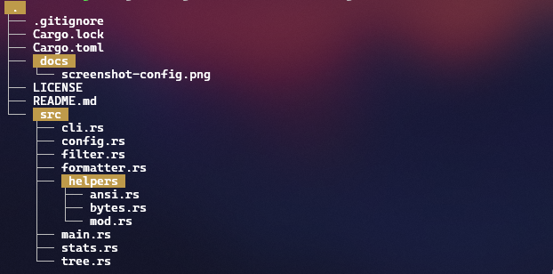

# `fstree`

A command-line utility that displays directory structure in a tree-like format.

<div align="center">
  
  
</div>

## 🌟 Features

- **Flexible Filtering**: Include or exclude files and directories using glob patterns.
- **Multiple Output Formats**: Choose between plain text, JSON, or other structured formats.
- **File Details**: Display file sizes in various formats (bytes, KB, MB, etc.).
- **Depth Control**: Limit the recursion depth to focus on specific parts of the file system.
- **Hidden Files**: Toggle the visibility of hidden files and directories.
- **Directory-Only Mode**: Display only directories, hiding all files.
- **Summary Report**: Get a summary of the total number of files and directories.
- **ANSI Color Support**: Colorful output for better readability, with an option to disable it.

---

<!-- ## Installation

You can install `fstree` using `cargo`:

```sh
cargo install fstree
``` -->

## 📖 Usage

```sh
fstree [OPTIONS] [ROOT]
```

### Options

| Short | Long             | Description                                                      | Default |
| ----- | ---------------- | ---------------------------------------------------------------- | ------- |
|       | `--full-path`    | Show the full path for each file entry.                          |         |
| `-p`  | `--prefix`       | The prefix string to use for each level of the tree.             | `├── `  |
| `-l`  | `--last-prefix`  | The prefix string to use for the last entry of each branch.      | `└── `  |
|       | `--child-prefix` | The prefix string to use for children of a branch.               | `│   `  |
| `-a`  | `--show-all`     | Show all files and directories, including hidden files.          |         |
| `-i`  | `--include`      | Show only files that match the pattern (glob syntax).            |         |
| `-e`  | `--exclude`      | Exclude files that match the pattern (glob syntax).              |         |
|       | `--ignore`       | Custom ignore files.                                             |         |
|       | `--directory`    | Show only directories.                                           |         |
| `-r`  | `--summary`      | Show a directory and file count summary.                         |         |
| `-s`  | `--size`         | Show the file size next to the name.                             |         |
|       | `--size-format`  | The format to use for the file size (e.g., `bytes`, `kb`, `mb`). | `bytes` |
| `-d`  | `--max-depth`    | The maximum depth to recurse.                                    |         |
|       | `--format`       | The output format to use (`text`, `json`).                       | `text`  |
|       | `--no-color`     | Disable ANSI colors.                                             |         |
|       | `--no-config`    | Do not load configuration from `config.json`.                    | `false` |

## ⚙️ Configuration

`fstree` supports loading configuration from a `config.json` file located at `~/.config/fstree/config.json`.

Command-line arguments take precedence over settings in the configuration file. You can prevent `fstree` from loading the configuration file using the `--no-config` option.

Example `config.json`:

```json
{
  "full-path": true,
  "max-depth": 3,
  "no-color": false
}
```

---

## 📄 License

This project is licensed under the [MIT License](./LICENSE).
